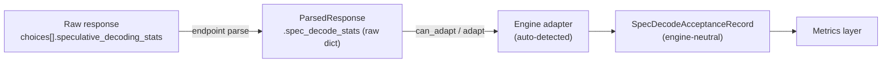

{/* SPDX-FileCopyrightText: Copyright (c) 2026 NVIDIA CORPORATION & AFFILIATES. All rights reserved.
SPDX-License-Identifier: Apache-2.0 */}

# Per-Request Speculative-Decoding Acceptance

When an inference server runs speculative decoding, it can report how well the
draft model did on each request: how many draft tokens it proposed, how many
were accepted, and the distribution of accepted-draft counts per verify step.
AIPerf captures this as an **engine-neutral per-request record** so the metrics
layer can reason about acceptance without knowing which engine produced it.

This page documents the record, the adapter interface that fills it, and the
vLLM adapter (the first supported engine). SGLang and TensorRT-LLM adapters are
future work and reuse the same record.

## The engine-neutral record

`SpecDecodeAcceptanceRecord`
([`src/aiperf/common/models/spec_decode_models.py`](https://github.com/ai-dynamo/aiperf/blob/main/src/aiperf/common/models/spec_decode_models.py))
is one record per request, attached to `ParsedResponseRecord.spec_decode_acceptance`.
It is deliberately **tree-agnostic** (a histogram, not per-position arrays) and
**adaptive-safe** (no fixed `k` assumption) so it survives variable-length
drafting such as DSpark-style adaptive verification.

| Field | Description |
| --- | --- |
| `engine` | Serving engine that produced the stats (e.g. `vllm`). |
| `mean_acceptance_length` | Mean tokens per verify step including the bonus token: `1 + num_accepted_draft_tokens / num_spec_steps`. Ranges `1.0` … `num_spec_tokens + 1`. |
| `draft_acceptance_rate` | `num_accepted_draft_tokens / num_draft_tokens`. Draft-only. |
| `acceptance_histogram` | Sparse `{accepted_draft_count: num_steps}` map with **integer** keys. Zero-count buckets omitted. Excludes the bonus token. |
| `num_accepted_draft_tokens` | Total accepted draft tokens (excludes bonus). |
| `num_draft_tokens` | Total proposed draft tokens counted toward acceptance (the denominator of `draft_acceptance_rate`). Engines that discard some proposals before counting report the post-adjustment total; see the engine section. |
| `num_spec_steps` | Number of verify steps. Equals the sum of the histogram counts. |
| `num_spec_tokens` | Maximum draft length per step (`k`) when the engine has a fixed per-step bound. `None` (the field is optional) when the engine reports no fixed bound, e.g. fully variable-length drafting. |
| `completion_tokens` | Output tokens for the request, copied from the response `usage` so a consumer holding only this record can normalize acceptance against output length. `None` when the response carried no usage. |
| `per_step_accepted` / `per_step_drafted` | Ordered arrays, one entry per verify step (a temporal axis — not positions in a draft tree). Present only when the engine reports per-step data; `None` otherwise. |

Descriptions here are engine-neutral; how a specific engine populates them (field
names, which level emits the per-step arrays, counting caveats) lives in that
engine's section below.

## The adapter interface

An adapter is the **only** component that knows an engine's on-the-wire
spec-decode shape. It reads the raw payload captured on the parsed responses
(`ParsedResponse.spec_decode_stats`) and returns a `SpecDecodeAcceptanceRecord`,
so nothing engine-specific leaks into the metrics layer.

Adapters are a plugin category (`spec_decode_adapter`) and are resolved by
**auto-detection**, mirroring custom-dataset-loader detection: the parser walks
registered adapters in priority order and uses the first whose `can_adapt`
recognizes the payload by its engine-specific signature — so an adapter claims
only its own payloads and defers on a foreign one. Both methods are classmethods
(adapters are stateless).

```python
@runtime_checkable
class SpecDecodeAdapterProtocol(Protocol):
    @classmethod
    def can_adapt(cls, responses: list[ParsedResponse]) -> bool: ...
    @classmethod
    def adapt(cls, responses: list[ParsedResponse]) -> SpecDecodeAcceptanceRecord | None: ...
```



## The vLLM adapter

`VLLMSpecDecodeAdapter` reads vLLM's per-choice `speculative_decoding_stats`
object, emitted when the server runs with `--per-request-spec-decode-stats`
(`summary` or `detailed`). The field names and shape track vLLM PR
[#48915](https://github.com/vllm-project/vllm/pull/48915); its *Per-Request
Acceptance Metrics* feature doc is the authoritative wire-format reference. It is
present on chat and completions, streaming and non-streaming; in streaming it
rides the finish-reason chunk's choice, which AIPerf already parses, so no extra
endpoint code is needed.

The wire object maps to the record one-to-one, except:

- **Histogram keys are JSON strings** and are int-cast into the record.
- **`completion_tokens`** comes from the response `usage`, not the payload. In
  streaming that usage rides the trailing `include_usage` chunk, which AIPerf
  auto-injects only when `endpoint.use_server_token_count` is enabled; otherwise
  (or whenever the server omits usage) `completion_tokens` stays `None`.
- **`num_draft_tokens`** is vLLM's post-adjustment count: drafts invalidated by
  structured-output/grammar constraints are already subtracted server-side.
- **`num_spec_tokens`** is always present (the configured `num_speculative_tokens`);
  vLLM's DSpark/DFlash drafters are fixed-block, so `k` stays defined even there.
- The `detailed` level adds `per_step_accepted` / `per_step_drafted`; `summary`
  omits them (they stay `None`).
- `mean_acceptance_length` / `draft_acceptance_rate` are taken verbatim
  (the server already computes them safely, including the zero-step case).

### Missing-field and edge cases

- **Field absent** (spec decode off, or the request had no verify steps): the
  record is `None` and dependent metrics simply do not show. This is the common
  case and is not an error.
- **Zero-step / fully-rejected**: reported verbatim (empty or `{0: N}`
  histogram, `mean_acceptance_length == 1.0`).
- **Malformed payload**: the adapter degrades to `None` rather than raising, so
  one bad response cannot abort a run. Records whose aggregate counts contradict
  each other (histogram not summing to `num_spec_steps`, etc.) are rejected the
  same way.
- **`n > 1`**: when a request produces multiple sequences, each choice carries
  its own per-sequence stats, but `completion_tokens` is request-level. Rather
  than mix one sequence's acceptance with all sequences' token count, the record
  is suppressed (`None`) for `n > 1`, mirroring how per-request timing metrics
  are suppressed for multi-sequence requests.
- **Behind Dynamo** the custom field is currently stripped, so this path is
  direct-to-vLLM only.
